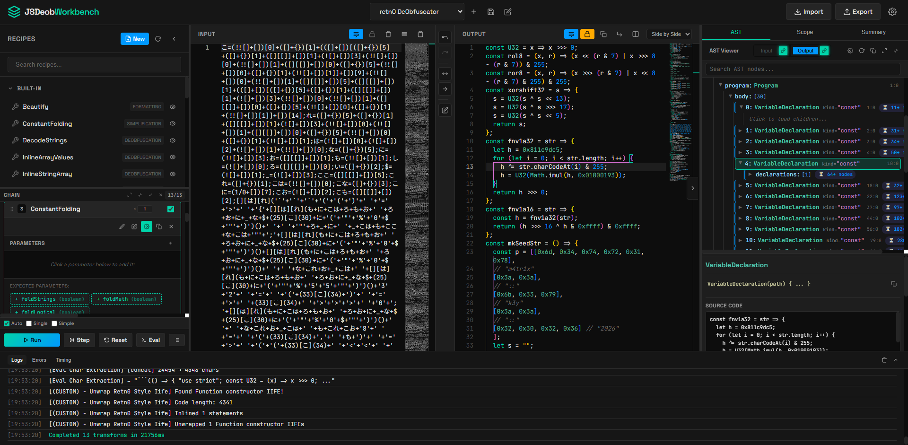
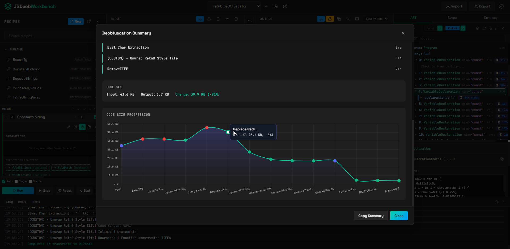
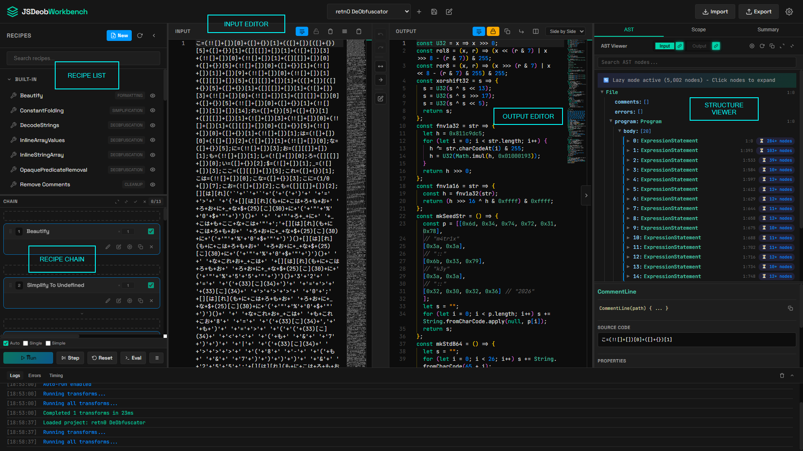
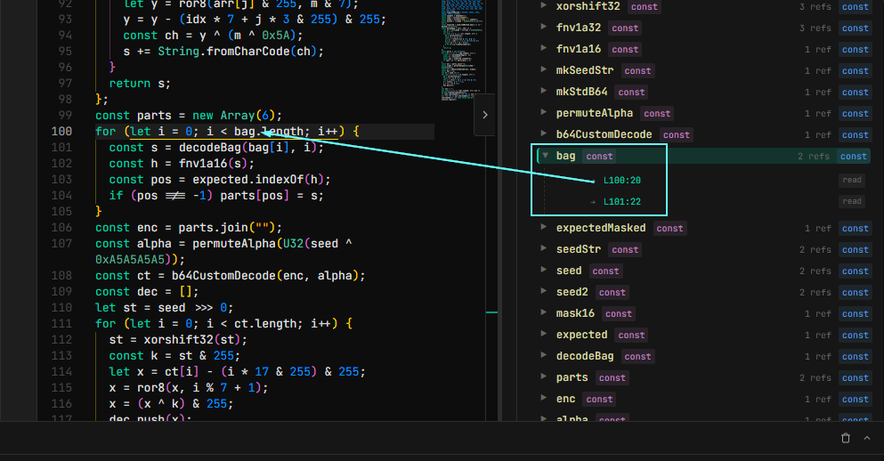
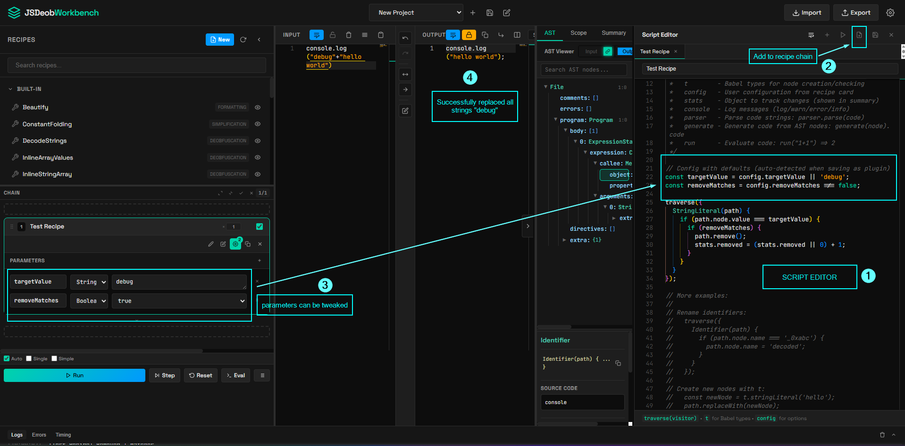
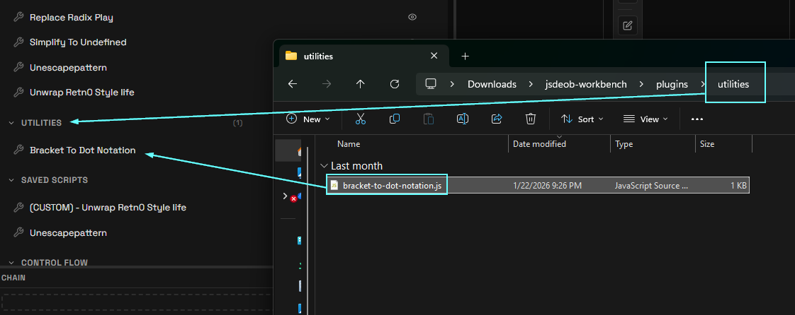
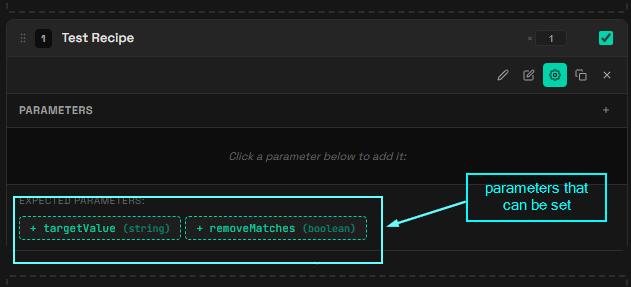
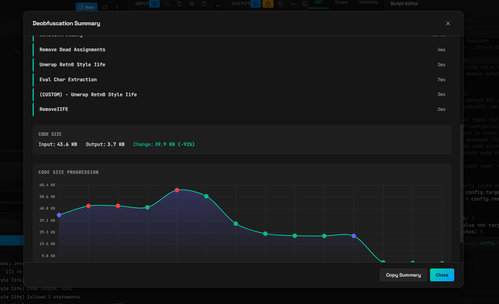

# jsdeob-workbench

A visual workbench for deobfuscating JavaScript. Build transform chains, step through them, write your own plugins.





## What is this?

This application reveals the Abstract Syntax Tree (AST) of JavaScript program. The idea came about when analyzing a obfuscatio.io related malware sample which ended up with me learning more about BabelJS for deobfuscation.
If you've ever tried to reverse engineer obfuscated JS (think: webpack bundles, obfuscator.io output, packed malware samples), you know it's painful. This tool lets you:

- Write transformation scripts based off BabelJS
- Quickly reference AST from the ASTViewer
- Chain multiple transforms together visually and get a summary to see changes.
- Share plugins with collaborators (Manual) and export configurations.
- Write patterns that you might use again for reuse as plugins.
- Save projects as you analyze other JS samples.


## Quick Start

```bash
npm install
npm start
# Open http://localhost:3000
```

That's it.

## The Interface

**Left sidebar** - All available transforms (built-ins + your recipe as plugins) including the recipe chain. (Think Cyberchef)

**Middle** - Input/Output editors. Paste your obfuscated code on the left and view transformed code on the right.

**Right panels** - AST viewer, scope analyzer, easy to view summary.




## Scope Analysis
BabelJS allows us to view the scope and bindings. This is especially useful to see if there are any unused variables for example. This view also allows us to look for locations where a variable is being referenced from.




## Writing Transforms

Hit the `+` button or press `Ctrl+N` to open the script editor. Transforms are just JS code with access to:

```javascript
// Available globals:
ast        // The parsed Babel AST
traverse   // Walk the tree: traverse({ Identifier(path) { ... } })
t          // Babel types: t.isStringLiteral(node), t.identifier('x')
config     // User config from the recipe card
stats      // Track your changes: stats.replaced = 5
parser     // Parse code: parser.parse('var x = 1')
generate   // Generate code: generate(node).code
run        // Eval helper: run('1+1') => 2 (DANGER. THIS IS MEANT TO BE RUN ON YOUR OWN MACHINE IN A SANDBOX)
```

Example - remove all `"debug"` strings (`StringLiteral`):

```javascript
// The following two will appear as parameter in recipe chain as seen in the next screenshot
const targetValue = config.targetValue || 'debug';
const removeMatches = config.removeMatches !== false;

traverse({
  StringLiteral(path) {
    if (path.node.value === targetValue) {
      if (removeMatches) {
        path.remove();
        stats.removed = (stats.removed || 0) + 1;
      }
    }
  }
});
```

You can choose to:
- Run this script straight via (CTRL + ENTER) for quick testing
- Add the written script into the recipe chain without saving as plugin (as shown in the screenshot). You can save this after
- Save this as plugin once you know it works and you want to share this plugin with others.


The screenshot below shows:
1. The script editor (Click on new button on top left OR shortcut with Ctrl-E)
2. After writing the BabelJS Script, add it to the recipe chain. 
3. In the recipe, with the detected parameter, we can modify the behaviour of the plugin.
4. The output editor shows the successful transformation.



## Built-in Transforms

Note that these may fail depending on the obfuscation technique and might require custom scripts. You can also modify them and save as new custom script too.

| Name | What it does |
|------|--------------|
| Beautify | Formats code nicely |
| Constant Folding | `1 + 2` → `3`, `"a" + "b"` → `"ab"` |
| Decode Strings | Decodes `\x48\x65\x6c\x6c\x6f` → `"Hello"` |
| Inline Array Values | Inlines simple array element accesses |
| Inline String Array | Inlines string arrays used by obfuscators |
| Opaque Predicate Removal | Removes always-true/false conditions |
| Remove Comments | Strips all comments from code |
| Remove IIFE | Unwraps `(function(){...})()` wrappers |
| Remove Unused Code | Deletes dead variables and functions |
| Simplify Literals | `!0` → `true`, `void 0` → `undefined` |

## Plugins

Drop your own `.js` files in `plugins/<category>/` subfolders. They'll show up in the sidebar grouped by folder.



For example:
- **Name**: Derived from filename (`Bracket-to-dot-notation.js` → "Decode Strings")
- **Category**: The subfolder name (`plugins/Utilities/` → category "nyx")


```javascript
/**
 * Bracket to Dot Notation
 * Changes things like  console["log"] to console.log
 * 
 * Category: utilities
 */

// Script Editor - Ctrl+Enter to run, Ctrl+E to close
// Use traverse(visitor) to modify the AST
// Access 't' for Babel types

traverse({
  MemberExpression(path) {
    if(path.node.computed === true){
      // this is the bracket notation
      
      prop = path.node.property
      if(t.isStringLiteral(prop)  &&
          /^[a-zA-Z_][a-zA-Z_0-9]*$/.test(prop.value)
       ){

        path.node.computed = false; // step 1

      // step 2 change literal to identifier
        path.node.property = t.identifier(prop.value)
      

      }
    }
  }

});

```

There are two methods to add parameters:
1. (This takes precedence and highly recommended) Following this format in code, script editor would attempt to create two parameters (`targetValue` and `removeMatches`
)
```js
const targetValue = config.targetValue || 'debug';
const removeMatches = config.removeMatches !== false;
```

2. If any parameters are missed due to edge cases, save as plugin allows to add additional parameters that might be missed.



## Main Summary

Includes:
- Time taken for each plugin to run
- Code size changes statistics
- Graph for visualization of changes



## Keyboard Shortcuts

| Key | Action |
|-----|--------|
| `Ctrl+E` | Toggle script editor |
| `Ctrl+Shift+E` | Toggle eval panel (DANGEROUS) |
| `Ctrl+S` | Save project |

## Building Standalone Exe

> NOTE THAT STANDALONE MIGHT HAVE ISSUES IF THERE ARE LOTS OF NESTED NODES. THE WORK AROUND MIGHT NOT WORK AT TIMES.

To build with npm, we can use the following
```bash
npm run build        # Windows only
```

Output goes to `dist/`. Copy the `plugins/` folder next to the exe if you want your custom transforms.

## Stack Size Issues

Deeply nested code (like JSFuck) can blow the stack. The build script tries to increase it automatically on Windows. If you get stack overflows, try to run from source with `npm start` (uses `--stack-size=65536`)

I have no figured out how to increase stack size when building into a standalone executable. Please let me know if you know how to!

## Credits

Built with:
- [Babel](https://babeljs.io/) - AST parsing and transforms
- [Monaco Editor](https://microsoft.github.io/monaco-editor/) - Code editor
- [Express](https://expressjs.com/) - Backend server

---


Questions? Issues? Open a GitHub issue.
